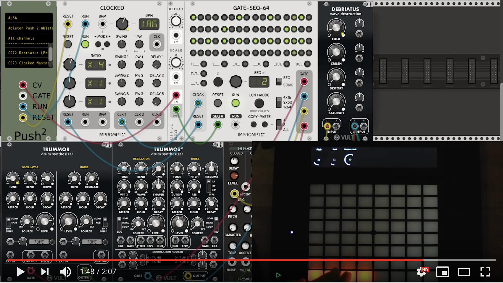

# VCV Rack modules

## AbletonPush2

A module for controlling VCV Rack via Ableton Push 2

[](https://www.youtube.com/watch?v=OhdxXv6uHF0)

Video overview

#### Features
* CV, GATE, PLAY button outputs
* Pad grouping and color mapping
* Mapping VCV parameters to Push encoders
* Push display feedback

#### Installation
* ```git clone https://github.com/ed9m/ed9m_vcv```
* ```cd ed9m_vcv```
* ```RACK_DIR=<path to Rack SDK> make install```

[Usage example](https://www.youtube.com/watch?v=Y2RphGohREE)

Tested on Ubuntu 18.04
